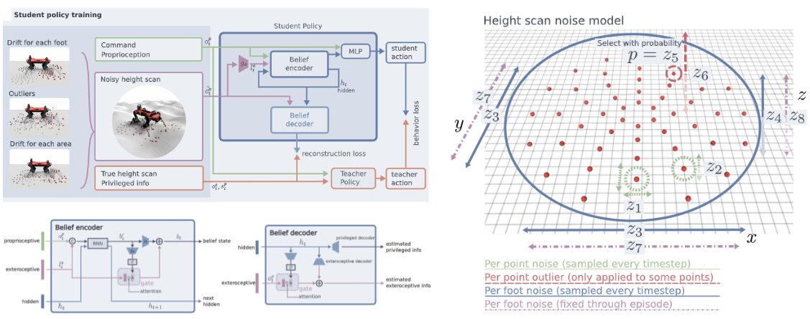

# Quadruped robot belief encoder
Implementation of some core elements of "Learning robust perceptive locomotion for quadrupedal robots in the wild" [[Paper](https://www.science.org/doi/10.1126/scirobotics.abk2822)]



# Description
This repository includes implementation of two elements.
1. Student policy network
2. Heightmap noise generator

Student policy network is composed of **belief encoder** and **belief decoder** to appropriately fuse both proprioceptive and exteroceptive sensor data. It is implemented in *Python*. 
Privilege information decoder, included in the paper, is excluded because they were not that critical in our experiement.

Heightmap noise generator is composed of **three noise models** to handle errors available in real-world use cases due to depth camera noise, state estimation error/drift etc. 
It is implemented in *C++* because the [Raisim](https://raisim.com/) simulator that we are actively using implements environments in *C++* for fast simulation.

# Dependencies
- numpy
- pytorch
- ruamel.yaml

# Run example
1. Student policy network
```
cd model
python main.py
```

2. Heightmap noise generator
```
cd noise_generator
mkdir build && cd build
cmake ..
make
# After build is finished
./noise_example
```

# Contributor
- [Yunho Kim](https://github.com/awesomericky)
- [Jinhyeok Choi](https://github.com/Triangle2022)
